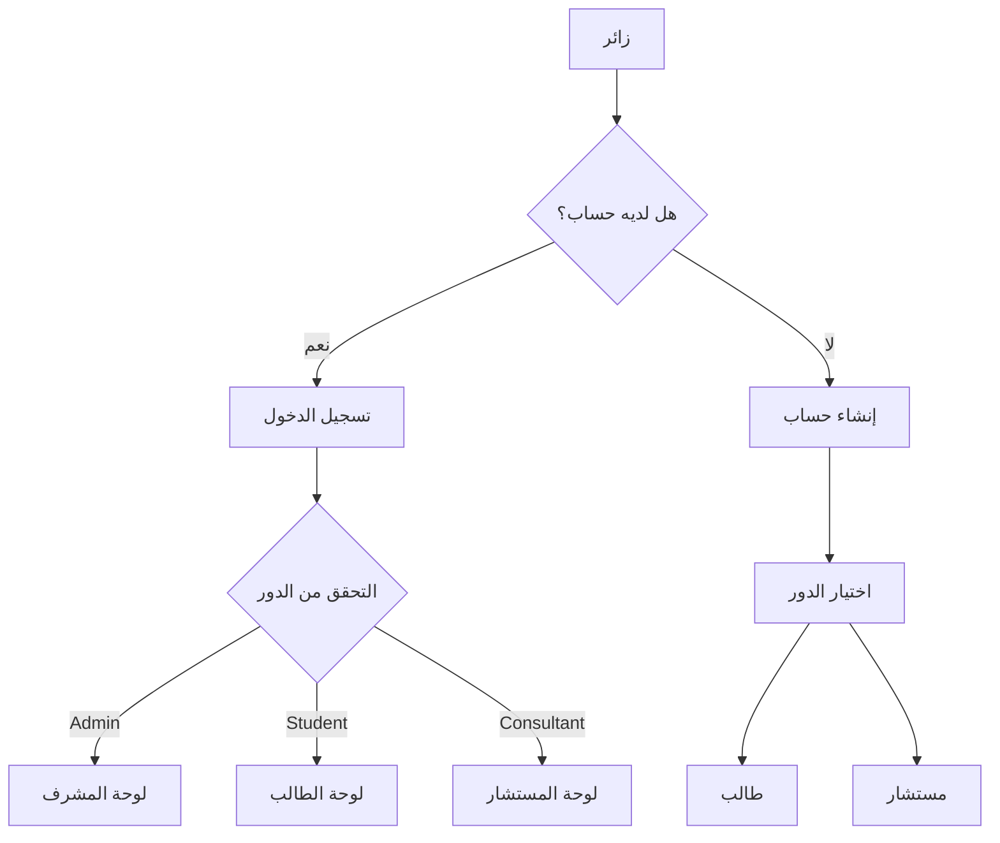
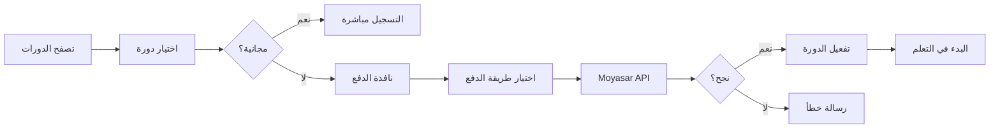
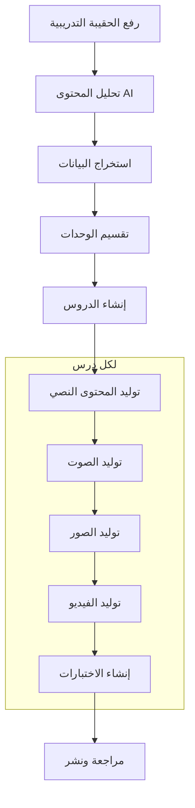
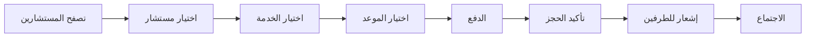
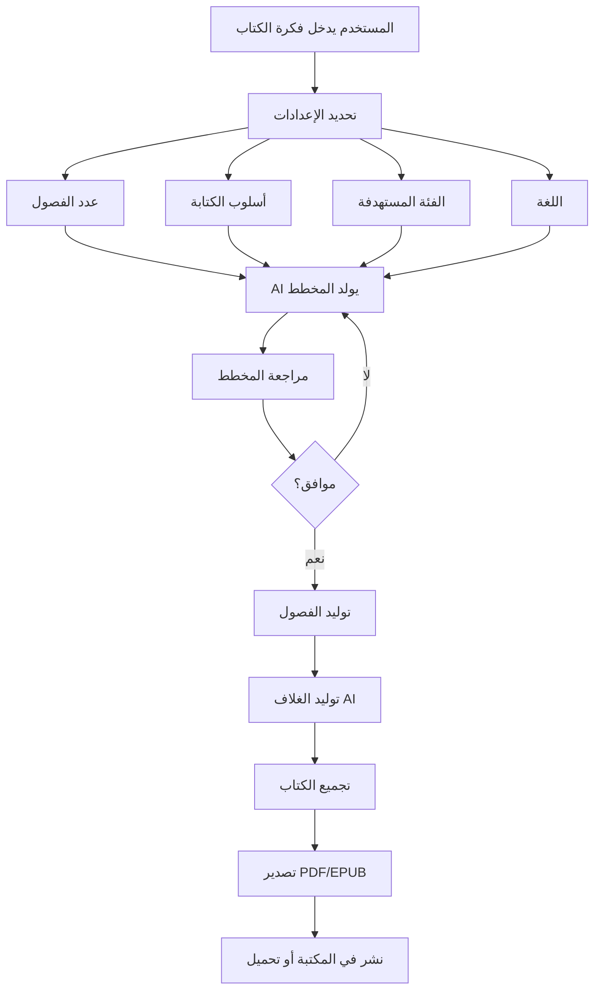

<div dir="rtl">

<div align="center">

# 📘 منصة فكر المستقبل
## Future Thinking Platform

### دليل المشروع الشامل والتوثيق الفني

---

**الإصدار:** 1.0  
**تاريخ التسليم:** يناير 2026  
**المطور:** Eng. Mohamed Essam

---


</div>

---

## 📑 جدول المحتويات

1. [نظرة عامة على المشروع](#-نظرة-عامة-على-المشروع)
2. [التقنيات المستخدمة (Tech Stack)](#-التقنيات-المستخدمة-tech-stack)
3. [هيكل الملفات والبنية](#-هيكل-الملفات-والبنية)
4. [سير العمل والتدفق (Workflow)](#-سير-العمل-والتدفق-workflow)
5. [مميزات الموقع](#-مميزات-الموقع)
6. [الأدوار والصلاحيات](#-الأدوار-والصلاحيات)
7. [الأسئلة الشائعة (FAQ)](#-الأسئلة-الشائعة-faq)
8. [اقتراحات التطوير المستقبلي](#-اقتراحات-التطوير-المستقبلي)
9. [إحصائيات المشروع](#-إحصائيات-المشروع)
10. [دليل التشغيل المحلي](#-دليل-التشغيل-المحلي)
11. [الدعم الفني وما بعد التسليم](#-الدعم-الفني-وما-بعد-التسليم)
12. [التوقيع](#-التوقيع)

---

## 🎯 نظرة عامة على المشروع

### ما هي منصة فكر المستقبل؟

منصة **فكر المستقبل** هي منصة تعليمية سعودية متكاملة تهدف إلى تقديم تجربة تعليمية استثنائية من خلال:

- **الدورات التدريبية**: نظام كامل لإنشاء وإدارة الدورات مع دعم الذكاء الاصطناعي لإنشاء المحتوى
- **الاستشارات**: ربط الطلاب بالمستشارين المتخصصين لحجز جلسات استشارية
- **المكتبة الرقمية**: بيع وشراء الكتب الإلكترونية
- **الشهادات**: إصدار شهادات معتمدة للطلاب عند إكمال الدورات

### الفئة المستهدفة

| الفئة | الوصف |
|-------|-------|
| 🎓 **الطلاب** | الباحثون عن التطوير المهني والشخصي |
| 🏢 **المؤسسات** | القطاع الحكومي والخاص للتدريب المؤسسي |
| 👨‍🏫 **المستشارون** | الخبراء الراغبون في تقديم خدماتهم |

---

## 💻 التقنيات المستخدمة (Tech Stack)

### Frontend (الواجهة الأمامية)

| التقنية | الإصدار | الاستخدام |
|---------|---------|-----------|
| **React** | 18.3.1 | مكتبة بناء واجهات المستخدم |
| **TypeScript** | 5.8.2 | لغة البرمجة الأساسية |
| **Vite** | 6.2.0 | أداة البناء والتطوير السريع |
| **Tailwind CSS** | - | تصميم الواجهات |
| **Framer Motion** | 11.0.24 | الحركات والانتقالات |
| **Lucide React** | 0.363.0 | الأيقونات |
| **Zustand** | 5.0.10 | إدارة الحالة |
| **React Hook Form** | 7.53.0 | إدارة النماذج |
| **Zod** | 4.3.5 | التحقق من البيانات |

### Backend (الخدمات الخلفية)

| التقنية | الاستخدام |
|---------|-----------|
| **Supabase** | قاعدة البيانات والمصادقة والتخزين |
| **PostgreSQL** | قاعدة البيانات الرئيسية |
| **Edge Functions (Deno)** | الوظائف السحابية |
| **Row Level Security** | أمان مستوى الصفوف |
| **Realtime** | التحديثات الفورية |

### خدمات الدفع

| التقنية | الاستخدام |
|---------|-----------|
| **Moyasar** | معالجة المدفوعات |
| **Apple Pay** | الدفع عبر أجهزة Apple |
| **Visa/Mastercard** | البطاقات الائتمانية |

### الذكاء الاصطناعي

| التقنية | الاستخدام |
|---------|-----------|
| **Wavespeed AI** | إنشاء المحتوى النصي |
| **DeepSeek v3.2** | نموذج اللغة الكبير |
| **Gemini AI** | تحليل المستندات |

### خدمات الوسائط

| التقنية | الاستخدام |
|---------|-----------|
| **Wavespeed API** | توليد الصور والصوت والفيديو |
| **Fish Speech** | تحويل النص إلى صوت عربي |
| **Wan-2.1** | توليد الفيديو بالذكاء الاصطناعي |
| **Flux.1** | توليد الصور |

---

## 📁 هيكل الملفات والبنية

```
future-thinking/
│
├── 📂 Frontend/
│   ├── 📂 components/
│   │   ├── 📂 admin/              # لوحة تحكم المشرف
│   │   │   ├── 📂 pages/          # صفحات المشرف (12 صفحة)
│   │   │   │   ├── AdminOverview.tsx
│   │   │   │   ├── AdminUsersPage.tsx
│   │   │   │   ├── AdminCourseManagement.tsx
│   │   │   │   ├── AdminLibraryManagement.tsx
│   │   │   │   ├── AdminConsultationsPage.tsx
│   │   │   │   ├── AdminFinancePage.tsx
│   │   │   │   ├── AdminSettingsPage.tsx
│   │   │   │   ├── AICourseCreator.tsx      # منشئ الدورات بالذكاء الاصطناعي ⭐
│   │   │   │   ├── AdminAIDraftsPage.tsx
│   │   │   │   ├── AICanvasEditor.tsx
│   │   │   │   └── AICreatorGuide.tsx
│   │   │   ├── AdminDashboard.tsx
│   │   │   ├── AdminSidebar.tsx
│   │   │   ├── AdminHeader.tsx
│   │   │   └── AdminContext.tsx
│   │   │
│   │   ├── 📂 dashboard/          # لوحة تحكم الطالب
│   │   │   ├── 📂 pages/          # صفحات الطالب (12 صفحة)
│   │   │   │   ├── MyCoursesPage.tsx
│   │   │   │   ├── CourseDetailsPage.tsx
│   │   │   │   ├── LibraryPage.tsx
│   │   │   │   ├── BookDetailsPage.tsx
│   │   │   │   ├── SchedulePage.tsx
│   │   │   │   ├── ConsultantDetailsPage.tsx
│   │   │   │   ├── PaymentsPage.tsx
│   │   │   │   ├── CertificatesPage.tsx
│   │   │   │   ├── ProfilePage.tsx
│   │   │   │   └── SettingsPage.tsx
│   │   │   ├── StudentDashboard.tsx
│   │   │   ├── DashboardLayout.tsx
│   │   │   └── DashboardContext.tsx
│   │   │
│   │   ├── 📂 consultant/         # لوحة تحكم المستشار
│   │   │   ├── 📂 pages/          # صفحات المستشار (7 صفحات)
│   │   │   │   ├── ConsultantOverview.tsx
│   │   │   │   ├── ConsultantServicesPage.tsx
│   │   │   │   ├── ConsultantSchedule.tsx
│   │   │   │   ├── ConsultantAnalytics.tsx
│   │   │   │   ├── ConsultantAICreator.tsx
│   │   │   │   ├── ConsultantAIDrafts.tsx
│   │   │   │   └── ConsultantSettings.tsx
│   │   │   ├── ConsultantDashboard.tsx
│   │   │   └── ConsultantContext.tsx
│   │   │
│   │   ├── 📂 public/             # الصفحات العامة
│   │   │   ├── PublicCourses.tsx
│   │   │   ├── PublicConsultations.tsx
│   │   │   └── PublicLibrary.tsx
│   │   │
│   │   ├── 📂 ui/                 # مكونات UI المشتركة
│   │   ├── 📂 pages/              # صفحات إضافية
│   │   │
│   │   ├── Navbar.tsx             # شريط التنقل
│   │   ├── Hero.tsx               # القسم الرئيسي
│   │   ├── Footer.tsx             # تذييل الصفحة
│   │   ├── AuthPage.tsx           # تسجيل الدخول
│   │   ├── GlobalContext.tsx      # السياق العام
│   │   └── PaymentModal.tsx       # نافذة الدفع
│   │
│   ├── 📂 services/               # خدمات API
│   │   ├── ai.ts                  # خدمة الذكاء الاصطناعي
│   │   ├── wavespeed.ts           # خدمة Wavespeed للوسائط
│   │   ├── voice.ts               # توليد الصوت
│   │   ├── video.ts               # توليد الفيديو
│   │   ├── payment.ts             # خدمة الدفع
│   │   ├── api.ts                 # API عامة
│   │   └── aiCourseStorage.ts     # تخزين دورات AI
│   │
│   ├── 📂 lib/                    # مكتبات مساعدة
│   │   └── supabase.ts            # اتصال Supabase
│   │
│   ├── 📂 types/                  # أنواع TypeScript
│   ├── App.tsx                    # المكون الرئيسي
│   ├── index.html                 # ملف HTML
│   ├── package.json               # التبعيات
│   └── vite.config.ts             # إعدادات Vite
│
├── 📂 Backend/
│   ├── 📂 supabase/
│   │   ├── 📂 functions/          # Edge Functions
│   │   │   ├── create-payment/    # إنشاء الفاتورة
│   │   │   ├── verify-payment/    # تأكيد الدفع (Webhook)
│   │   │   ├── applepay-payment/  # Apple Pay
│   │   │   └── generate-ai-content/ # محتوى AI
│   │   ├── schema.sql             # هيكل قاعدة البيانات
│   │   ├── rls_policies.sql       # سياسات الأمان
│   │   ├── storage.sql            # إعدادات التخزين
│   │   └── seed.sql               # بيانات تجريبية
│   └── README.md
│
└── 📄 ملفات الجذر
    ├── Symbol.png                 # شعار الموقع
    └── full_auth_setup.sql        # إعداد المصادقة
```

---

## 🔄 سير العمل والتدفق (Workflow)

### تدفق المستخدم العام



### تدفق شراء دورة



### تدفق إنشاء دورة بالذكاء الاصطناعي



### تدفق حجز استشارة



---

## ✨ مميزات الموقع

### 🎨 تصميم الواجهة
- ✅ تصميم عصري متجاوب كليًا (Responsive)
- ✅ دعم كامل للغة العربية (RTL)
- ✅ حركات سلسة (Framer Motion)
- ✅ الوضع الداكن
- ✅ تجربة مستخدم سهلة

### 🔐 الأمان والمصادقة
- ✅ تسجيل الدخول بالبريد الإلكتروني
- ✅ تسجيل الدخول عبر Google OAuth
- ✅ استعادة كلمة المرور
- ✅ حماية RLS على مستوى قاعدة البيانات
- ✅ وضع الصيانة للمشرفين فقط

### 📚 نظام الدورات
- ✅ إنشاء وإدارة الدورات
- ✅ تتبع تقدم الطالب
- ✅ دروس متعددة الأنواع (فيديو، قراءة، اختبار)
- ✅ نظام الوحدات والفصول
- ✅ إصدار الشهادات عند الإكمال

### 🤖 الذكاء الاصطناعي المتكامل
- ✅ **منشئ الدورات الذكي**: تحويل الحقائب التدريبية إلى دورات كاملة
- ✅ **توليد المحتوى**: نصوص تعليمية بـ 1500+ كلمة
- ✅ **توليد الصوت**: تحويل النص لصوت عربي طبيعي
- ✅ **توليد الصور**: صور توضيحية للدروس
- ✅ **توليد الفيديو**: مقاطع قصيرة للدروس
- ✅ **إنشاء الاختبارات**: MCQ وصح/خطأ

### 💳 نظام المدفوعات
- ✅ Moyasar Gateway (سعودي)
- ✅ Apple Pay
- ✅ Visa/Mastercard
- ✅ سجل المعاملات
- ✅ Webhook للتأكيد الفوري

### 📖 المكتبة الرقمية
- ✅ بيع الكتب الإلكترونية
- ✅ معاينة قبل الشراء
- ✅ تصنيفات وفلاتر
- ✅ تحميل آمن للمشترين

### 🗓️ نظام الاستشارات
- ✅ ملفات تعريف المستشارين
- ✅ خدمات متعددة لكل مستشار
- ✅ حجز المواعيد
- ✅ روابط اجتماعات (Zoom, Meet, Teams)
- ✅ التقييمات والمراجعات

### 🔔 الإشعارات الفورية
- ✅ Realtime عبر Supabase
- ✅ إشعارات نظام متنوعة
- ✅ تصنيف (نجاح، معلومات، تحذير، خطأ)

### 📊 لوحة التحكم والتقارير
- ✅ إحصائيات شاملة
- ✅ رسوم بيانية تفاعلية
- ✅ تقارير المبيعات
- ✅ نشاط المستخدمين

---

## 👥 الأدوار والصلاحيات

### 🛡️ المشرف (Admin)

| الصلاحية | الوصف |
|----------|-------|
| ✅ إدارة المستخدمين | إضافة/تعديل/حذف جميع المستخدمين |
| ✅ إدارة الدورات | إنشاء/تعديل/حذف أي دورة |
| ✅ إدارة المكتبة | إضافة/تعديل/حذف الكتب |
| ✅ إدارة الاستشارات | الموافقة/رفض خدمات المستشارين |
| ✅ التقارير المالية | عرض جميع المعاملات والإيرادات |
| ✅ إعدادات النظام | تفعيل/إيقاف وضع الصيانة |
| ✅ منشئ الدورات AI | الوصول الكامل لأدوات AI |
| ✅ إدارة الإشعارات | إرسال إشعارات للجميع |
| ✅ مسودات AI | عرض جميع المسودات |
| ✅ تجاوز الصيانة | الوصول أثناء وضع الصيانة |

### 👨‍🏫 المستشار (Consultant)

| الصلاحية | الوصف | غير متاح |
|----------|-------|----------|
| ✅ لوحة التحكم | إحصائيات الاستشارات والأرباح | ❌ إدارة المستخدمين |
| ✅ خدماتي | إضافة/تعديل خدماته الخاصة | ❌ نشر الدورات مباشرة |
| ✅ جدول المواعيد | عرض/إدارة حجوزاته | ❌ التقارير المالية الكاملة |
| ✅ التحليلات | إحصائيات أدائه فقط | ❌ إعدادات النظام |
| ✅ منشئ المحتوى AI | إنشاء مسودات فقط | ❌ حذف دورات الآخرين |
| ✅ ملفه الشخصي | تعديل بياناته | ❌ تجاوز الصيانة |

### 🎓 الطالب (Student)

| الصلاحية | الوصف | غير متاح |
|----------|-------|----------|
| ✅ لوحة التحكم | نظرة عامة على نشاطه | ❌ إنشاء دورات |
| ✅ دوراتي | عرض الدورات المسجل بها | ❌ إدارة الاستشارات |
| ✅ المكتبة | شراء وتحميل الكتب | ❌ أي صلاحيات إدارية |
| ✅ المواعيد | حجز استشارات | ❌ التقارير المالية |
| ✅ المدفوعات | سجل مشترياته | ❌ إعدادات النظام |
| ✅ الشهادات | عرض وتحميل شهاداته | ❌ منشئ AI |
| ✅ الملف الشخصي | تعديل بياناته | ❌ تجاوز الصيانة |
| ✅ الإعدادات | تفضيلاته الشخصية | - |

---

## ❓ الأسئلة الشائعة (FAQ)

### أسئلة عامة

<details>
<summary><strong>ما هي منصة فكر المستقبل؟</strong></summary>

منصة فكر المستقبل هي منصة تعليمية سعودية شاملة تقدم دورات تدريبية، استشارات متخصصة، ومكتبة رقمية. تتميز بدعم الذكاء الاصطناعي لإنشاء المحتوى التعليمي بشكل آلي.
</details>

<details>
<summary><strong>ما هي طرق الدفع المتاحة؟</strong></summary>

نقبل الدفع عبر:
- البطاقات الائتمانية (Visa/Mastercard)
- Apple Pay
- جميع المدفوعات آمنة عبر Moyasar Gateway
</details>

<details>
<summary><strong>هل يمكنني استرداد أموالي؟</strong></summary>

نعم، يمكن طلب استرداد المبلغ خلال 7 أيام من الشراء إذا لم يتم البدء في الدورة. يرجى التواصل مع الدعم الفني.
</details>

### أسئلة تقنية

<details>
<summary><strong>ما هي المتصفحات المدعومة؟</strong></summary>

- Google Chrome (الإصدار 90+)
- Mozilla Firefox (الإصدار 88+)
- Safari (الإصدار 14+)
- Microsoft Edge (الإصدار 90+)
</details>

<details>
<summary><strong>هل يعمل الموقع على الجوال؟</strong></summary>

نعم، الموقع متجاوب بالكامل ويعمل على جميع الأجهزة (هواتف، تابلت، كمبيوتر).
</details>

<details>
<summary><strong>كيف يعمل نظام الذكاء الاصطناعي؟</strong></summary>

نستخدم نماذج AI متقدمة (DeepSeek, Wavespeed) لـ:
- تحليل الحقائب التدريبية
- إنشاء محتوى الدروس
- توليد الصوت والصور والفيديو
- إنشاء الاختبارات تلقائيًا
</details>

### أسئلة للعملاء المحتملين

<details>
<summary><strong>هل يمكن تخصيص المنصة؟</strong></summary>

نعم، يمكن تخصيص:
- الألوان والشعار
- الميزات والصفحات
- طرق الدفع
- التكاملات مع أنظمة أخرى
</details>

<details>
<summary><strong>كم تكلفة الاستضافة الشهرية؟</strong></summary>

تعتمد على حجم الاستخدام:
- Supabase: مجاني حتى حد معين، ثم من $25/شهر
- Wavespeed AI: حسب الاستخدام
- نطاق واستضافة: يعتمد على المزود
</details>

<details>
<summary><strong>هل يمكن إضافة تطبيق جوال؟</strong></summary>

نعم، يمكن تحويل المنصة إلى تطبيق جوال باستخدام:
- React Native
- أو Flutter
- أو PWA (تطبيق ويب تقدمي)
</details>

---

## 🚀 اقتراحات التطوير المستقبلي

### 📱 المرحلة الأولى - تطبيق الجوال

| الميزة | الوصف | الأولوية |
|--------|-------|---------|
| 📲 تطبيق iOS/Android | تحويل المنصة لتطبيق أصلي | ⭐⭐⭐⭐⭐ |
| 🔔 Push Notifications | إشعارات فورية على الجوال | ⭐⭐⭐⭐⭐ |
| 📥 تحميل للمشاهدة Offline | تحميل الدروس بدون انترنت | ⭐⭐⭐⭐ |
| 🎥 مشغل فيديو محسّن | Picture-in-Picture, سرعات | ⭐⭐⭐⭐ |

### 🎮 المرحلة الثانية - Gamification

| الميزة | الوصف | الأولوية |
|--------|-------|---------|
| 🏆 نظام النقاط والشارات | مكافآت على الإنجازات | ⭐⭐⭐⭐ |
| 📊 لوحة المتصدرين | منافسة بين الطلاب | ⭐⭐⭐⭐ |
| 🎯 التحديات الأسبوعية | مسابقات دورية | ⭐⭐⭐ |
| 🎁 مكافآت قابلة للاستبدال | خصومات وجوائز | ⭐⭐⭐ |

### 🤖 المرحلة الثالثة - AI متقدم

| الميزة | الوصف | الأولوية |
|--------|-------|---------|
| 💬 مساعد AI ذكي (Chatbot) | دعم فوري للطلاب | ⭐⭐⭐⭐⭐ |
| 📝 تصحيح الواجبات تلقائيًا | AI لتقييم الإجابات | ⭐⭐⭐⭐ |
| 🎯 مسار تعلم مخصص | توصيات شخصية | ⭐⭐⭐⭐ |
| 🗣️ محادثة صوتية AI | تدريب المحادثة | ⭐⭐⭐ |

### 💰 المرحلة الرابعة - نماذج الربح

| الميزة | الوصف | الأولوية |
|--------|-------|---------|
| 🏷️ نظام الاشتراكات | خطط شهرية/سنوية | ⭐⭐⭐⭐⭐ |
| 🎫 كوبونات الخصم | نظام قسائم متقدم | ⭐⭐⭐⭐ |
| 👥 التسويق بالعمولة | برنامج Affiliate | ⭐⭐⭐⭐ |
| 🏢 اشتراكات B2B للشركات | باقات مؤسسية | ⭐⭐⭐⭐ |
| 🎁 بطاقات الهدايا | Gift Cards | ⭐⭐⭐ |

### 📈 المرحلة الخامسة - تحليلات متقدمة

| الميزة | الوصف | الأولوية |
|--------|-------|---------|
| 📊 Dashboard تفاعلي | رسوم بيانية متقدمة | ⭐⭐⭐⭐ |
| 📧 تقارير أسبوعية بالإيميل | ملخص النشاط | ⭐⭐⭐ |
| 🔍 تحليل سلوك المستخدم | Heatmaps, Funnels | ⭐⭐⭐ |
| 📉 توقعات AI للمبيعات | Predictive Analytics | ⭐⭐⭐ |

### 🌍 المرحلة السادسة - التوسع

| الميزة | الوصف | الأولوية |
|--------|-------|---------|
| 🌐 دعم لغات متعددة | إنجليزي، فرنسي | ⭐⭐⭐⭐ |
| 💱 عملات متعددة | USD, EUR, AED | ⭐⭐⭐⭐ |
| 🎥 بث مباشر | Live Classes | ⭐⭐⭐⭐ |
| 📝 منتدى النقاش | Community Forum | ⭐⭐⭐ |
| 🤝 نظام المجموعات | Study Groups | ⭐⭐⭐ |

### 🔒 المرحلة السابعة - أمان وموثوقية

| الميزة | الوصف | الأولوية |
|--------|-------|---------|
| 🔐 مصادقة ثنائية (2FA) | OTP عبر SMS | ⭐⭐⭐⭐⭐ |
| 📋 Audit Log | سجل العمليات | ⭐⭐⭐⭐ |
| 💾 نسخ احتياطي تلقائي | Daily Backups | ⭐⭐⭐⭐ |
| 🛡️ مكافحة الاحتيال | Fraud Detection | ⭐⭐⭐ |

### 🎨 المرحلة الثامنة - تحسينات UX

| الميزة | الوصف | الأولوية |
|--------|-------|---------|
| 🌙 الوضع الداكن الكامل | Dark Mode | ⭐⭐⭐⭐ |
| ♿ إمكانية الوصول | Accessibility (WCAG) | ⭐⭐⭐⭐ |
| ⌨️ اختصارات لوحة المفاتيح | Keyboard Shortcuts | ⭐⭐⭐ |
| 🖱️ السحب والإفلات | Drag & Drop | ⭐⭐⭐ |

---

### 📚 المرحلة التاسعة - نظام توليد الكتب بالذكاء الاصطناعي (خدمة مدفوعة) 💰

> **💡 فكرة مميزة لمصدر دخل جديد!**
> 
> نظام متكامل لتوليد كتب كاملة بالذكاء الاصطناعي، يمكن تقديمه كخدمة مدفوعة تجلب إيرادات مستمرة للمنصة.

#### 🎯 كيف يعمل النظام؟



#### 📋 مميزات النظام

| الميزة | الوصف |
|--------|-------|
| 📝 **توليد المحتوى الكامل** | فصول كاملة بمحتوى عربي أو إنجليزي عالي الجودة |
| 🎨 **تصميم الغلاف AI** | توليد غلاف احترافي بالذكاء الاصطناعي |
| 📊 **جدول المحتويات التلقائي** | إنشاء فهرس منظم تلقائياً |
| ✏️ **محرر مدمج** | تعديل المحتوى قبل التصدير |
| 📖 **تنسيقات متعددة** | PDF, EPUB, DOCX |
| 🔄 **إعادة التوليد** | إعادة توليد أي فصل غير مناسب |
| 🎯 **أنماط متعددة** | علمي، أدبي، تعليمي، تطوير ذات، أطفال |
| 🌐 **دعم ثنائي اللغة** | عربي وإنجليزي |

#### 💰 نموذج الربح (التسعير المقترح)

| الباقة | السعر | المميزات |
|--------|-------|----------|
| 📕 **كتاب قصير** | 99 ر.س | 5-10 فصول، ~50 صفحة |
| 📗 **كتاب متوسط** | 199 ر.س | 10-20 فصل، ~100 صفحة |
| 📘 **كتاب كامل** | 349 ر.س | 20-30 فصل، ~200 صفحة، غلاف مخصص |
| 📚 **باقة المؤلف** | 999 ر.س/شهر | كتب غير محدودة، أولوية التوليد |

#### 🎯 الفئات المستهدفة

| الفئة | الاستخدام |
|-------|-----------|
| 👨‍🏫 **المدربون** | تحويل خبراتهم لكتب تُباع على المنصة |
| 🎓 **الطلاب** | إنشاء ملخصات ومراجع دراسية |
| 🏢 **الشركات** | أدلة تدريب الموظفين |
| ✍️ **الكُتّاب المبتدئون** | بداية سريعة في عالم التأليف |
| 📱 **صناع المحتوى** | تحويل المحتوى لكتب إلكترونية |

#### 🔧 المتطلبات التقنية

| المكون | التقنية |
|--------|---------|
| **توليد النص** | DeepSeek v3.2 / GPT-4 |
| **توليد الغلاف** | Flux.1 / DALL-E |
| **تصدير PDF** | React-PDF / Puppeteer |
| **تصدير EPUB** | epub-gen |
| **التخزين** | Supabase Storage |
| **الدفع** | Moyasar (نفس النظام الحالي) |

#### 📈 العائد المتوقع

| السيناريو | الإيرادات الشهرية |
|-----------|-------------------|
| 🔹 50 كتاب/شهر (متوسط 200 ر.س) | 10,000 ر.س |
| 🔸 100 كتاب/شهر + 10 اشتراكات | 30,000 ر.س |
| 🔶 200 كتاب/شهر + 30 اشتراك | 70,000+ ر.س |

#### ⭐ الأولوية: ⭐⭐⭐⭐⭐ (مصدر دخل مستدام + ميزة تنافسية فريدة)

---

## 📊 إحصائيات المشروع

### حجم الكود

| القسم | الملفات | الأسطر (تقريبي) |
|-------|---------|-----------------|
| **Frontend Components** | 80+ | 45,000+ |
| **Services** | 13 | 8,000+ |
| **Backend Functions** | 4 | 2,000+ |
| **SQL Schema** | 4 | 600+ |
| **إجمالي** | **100+** | **55,000+** |

### قاعدة البيانات

| الجدول | الوصف |
|--------|-------|
| `profiles` | بيانات المستخدمين |
| `consultant_profiles` | بيانات المستشارين |
| `consultation_services` | خدمات الاستشارات |
| `courses` | الدورات |
| `lessons` | الدروس |
| `course_enrollments` | تسجيلات الدورات |
| `books` | الكتب |
| `book_purchases` | مشتريات الكتب |
| `reviews` | التقييمات |
| `appointments` | المواعيد |
| `transactions` | المعاملات المالية |
| `notifications` | الإشعارات |
| `certificates` | الشهادات |
| `ai_drafts` | مسودات AI |
| `ai_course_generations` | دورات AI المولدة |
| `ai_generated_lessons` | دروس AI |
| `system_settings` | إعدادات النظام |

### Edge Functions

| الوظيفة | الغرض |
|---------|-------|
| `create-payment` | إنشاء فاتورة Moyasar |
| `verify-payment` | Webhook تأكيد الدفع |
| `applepay-payment` | معالجة Apple Pay |
| `generate-ai-content` | توليد محتوى AI |

### الأداء

| المقياس | القيمة |
|---------|--------|
| **حجم الـ Bundle** | ~850KB (gzipped) |
| **First Contentful Paint** | < 1.5s |
| **Lighthouse Score** | 85+ |
| **دعم المتصفحات** | 95%+ |

---

## 🛠️ دليل التشغيل المحلي

### المتطلبات الأساسية

| البرنامج | الإصدار | الرابط |
|----------|---------|--------|
| **Node.js** | 18+ | [nodejs.org](https://nodejs.org) |
| **npm** | 9+ | يأتي مع Node.js |
| **Git** | Latest | [git-scm.com](https://git-scm.com) |
| **VS Code** | Latest | [code.visualstudio.com](https://code.visualstudio.com) |

### الخطوة 1: تثبيت Node.js

1. اذهب إلى [nodejs.org](https://nodejs.org)
2. حمّل الإصدار LTS (Long Term Support)
3. شغّل ملف التثبيت واتبع الخطوات
4. تحقق من التثبيت:

```bash
node --version
# يجب أن يظهر: v18.x.x أو أحدث

npm --version
# يجب أن يظهر: 9.x.x أو أحدث
```

### الخطوة 2: نسخ المشروع

```bash
# إذا كان المشروع على GitHub
git clone <repository-url>
cd future-thinking

# أو إذا كان لديك الملفات مباشرة
cd "c:\Users\attar\Desktop\future thinking"
```

### الخطوة 3: تشغيل Frontend

```bash
# الانتقال لمجلد Frontend
cd Frontend

# تثبيت المكتبات
npm install

# ⏳ انتظر حتى اكتمال التثبيت (قد يستغرق 2-5 دقائق)

# تشغيل خادم التطوير
npm run dev
```

سيظهر لك:
```
VITE v6.2.0  ready in 500 ms

➜  Local:   http://localhost:5173/
➜  Network: use --host to expose
```

افتح المتصفح على: **http://localhost:5173**

### الخطوة 4: إعداد ملف البيئة (.env)

أنشئ ملف `.env.local` في مجلد Frontend:

```env
VITE_SUPABASE_URL=https://YOUR_PROJECT.supabase.co
VITE_SUPABASE_ANON_KEY=eyJhbGci...YOUR_ANON_KEY
VITE_GEMINI_API_KEY=AIza...YOUR_GEMINI_KEY
VITE_WAVESPEED_API_KEY=YOUR_WAVESPEED_KEY
```

### الخطوة 5: إعداد Backend (Supabase)

```bash
# الانتقال لمجلد Backend
cd Backend

# تثبيت Supabase CLI
npm install -g supabase

# تسجيل الدخول
supabase login

# ربط المشروع
supabase link --project-ref YOUR_PROJECT_REF

# نشر Edge Functions
supabase functions deploy create-payment
supabase functions deploy verify-payment
supabase functions deploy applepay-payment
supabase functions deploy generate-ai-content
```

### الخطوة 6: تنفيذ ملفات SQL

في Supabase Dashboard → SQL Editor:

1. نفذ `schema.sql` أولاً
2. ثم `rls_policies.sql`
3. ثم `storage.sql`
4. اختياري: `seed.sql` للبيانات التجريبية

### أوامر مفيدة

```bash
# تشغيل Frontend
cd Frontend && npm run dev

# بناء نسخة الإنتاج
cd Frontend && npm run build

# معاينة نسخة الإنتاج
cd Frontend && npm run preview

# نشر Edge Functions
cd Backend && supabase functions deploy --all
```

---

## 🤝 الدعم الفني وما بعد التسليم

### ✅ ما يشمله التسليم

- ✅ الكود المصدري الكامل (Frontend + Backend)
- ✅ قاعدة البيانات مع البنية الكاملة
- ✅ Edge Functions جاهزة للنشر
- ✅ هذا الملف التوثيقي الشامل
- ✅ دليل التشغيل المحلي

### 🔧 فحص نهائي بعد التسليم

> **التزام المطور:**
> 
> بعد تسليم المشروع، سأقوم بإجراء **فحص نهائي شامل للموقع** للتأكد من:
> - عمل جميع الصفحات بشكل صحيح
> - اتصال قاعدة البيانات
> - عمل نظام الدفع
> - عمل ميزات الذكاء الاصطناعي
> - التوافق مع جميع المتصفحات

### 🛡️ ضمان ما بعد التسليم

> **التزام بالدعم المجاني:**
> 
> أتعهد بتقديم الدعم الفني **المجاني بالكامل** في الحالات التالية:
> 
> | الحالة | مشمولة؟ |
> |--------|---------|
> | ✅ أخطاء في الكود الحالي | **مجاني** |
> | ✅ مشاكل تظهر بعد التسليم | **مجاني** |
> | ✅ Bugs في الوظائف الموجودة | **مجاني** |
> | ✅ مشاكل التوافق | **مجاني** |
> | ❌ ميزات جديدة | يتطلب اتفاق جديد |
> | ❌ تغييرات في التصميم | يتطلب اتفاق جديد |
> | ❌ إضافات للمشروع | يتطلب اتفاق جديد |

### 📞 طريقة التواصل للدعم

1. وصف المشكلة بالتفصيل
2. إرفاق صور للخطأ إن وجد
3. ذكر الخطوات التي أدت للمشكلة
4. سأرد في أقرب وقت ممكن

---

## ✍️ التوقيع

<div align="center">

---

### 👨‍💻 المطور

# **Eng. Mohamed Essam**
## Senior Full Stack Developer

---

**تاريخ التسليم:** يناير 2026

**جميع الحقوق محفوظة © 2026**

---

*شكراً لثقتكم في العمل معي*

*أتطلع للتعاون معكم في المشاريع المستقبلية*

---

</div>

</div>
